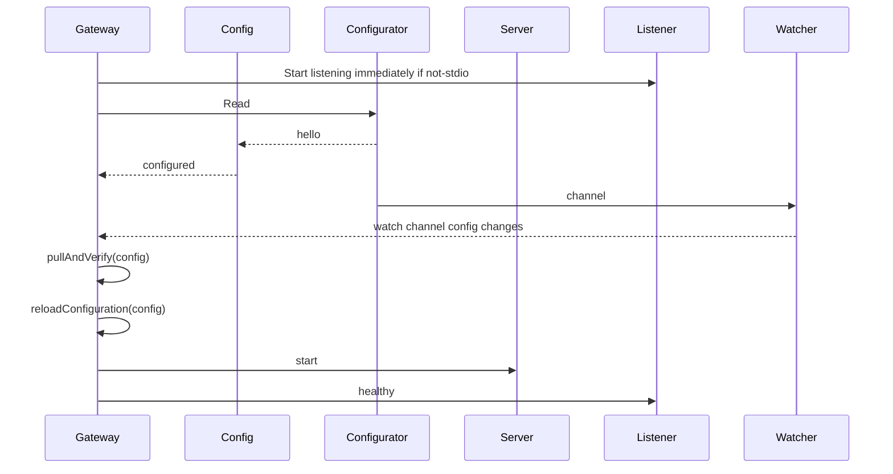
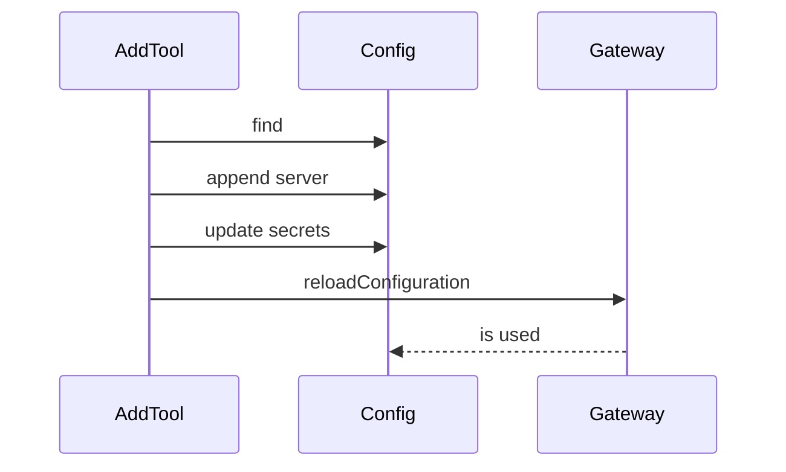

# Gateway startup

## Reading Config

The `Read` method in `Configurator` is responsible for building an initial `Configuration`

* serverNames
* catalog.Servers (this is our catalog)
    * read from catalog.yaml files
    * read from oci artifacts
* config map
* tool filters
* secret providers
    * DD
    * file

## reloadConfiguration

The gateway `reloadConfiguration` extracts capabilities from the current configuration, and updates the Server. It starts up the server to do this.

When running servers raise change notifications, the capabilities also have to be reloaded.

# Dynamic Server Add

Another place where the capabilities should be considered _dynamic_ is with the `mcp-server-add` tool. This tool loads new mcp servers into a gateway session.

During `reloadConfiguration` all updates to capabilities will cause change events to be sent to any clients connected to this server.

# Images without Catalogs

A Docker Image can contain its own catalog description via the
`io.docker.server.metadata` label. When such an image is referenced
through a profile or working set (see [profiles](profiles.md)), the
label is parsed through the narrow `ImportedServer` schema so that only
descriptive metadata is trusted. Runtime-shaping fields and secrets are
sourced exclusively from curated catalogs or user configuration.

